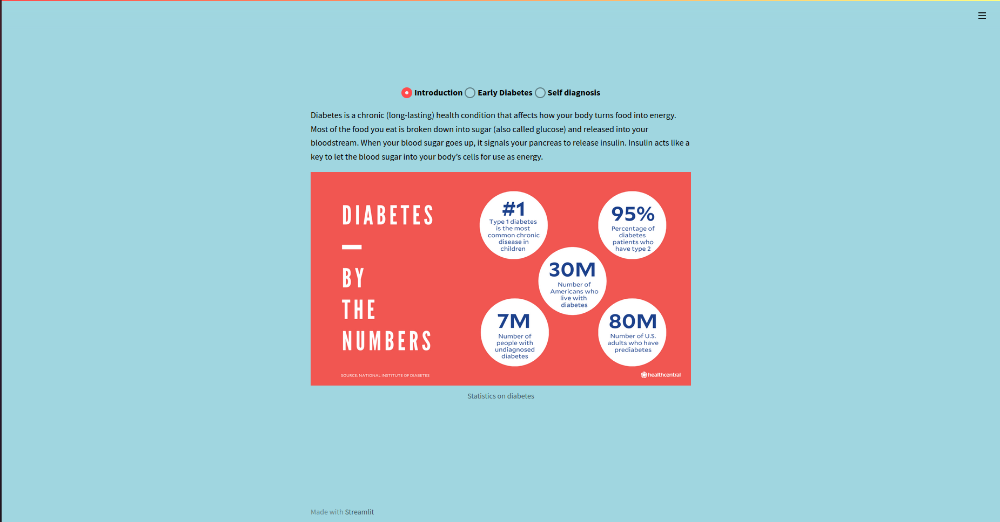
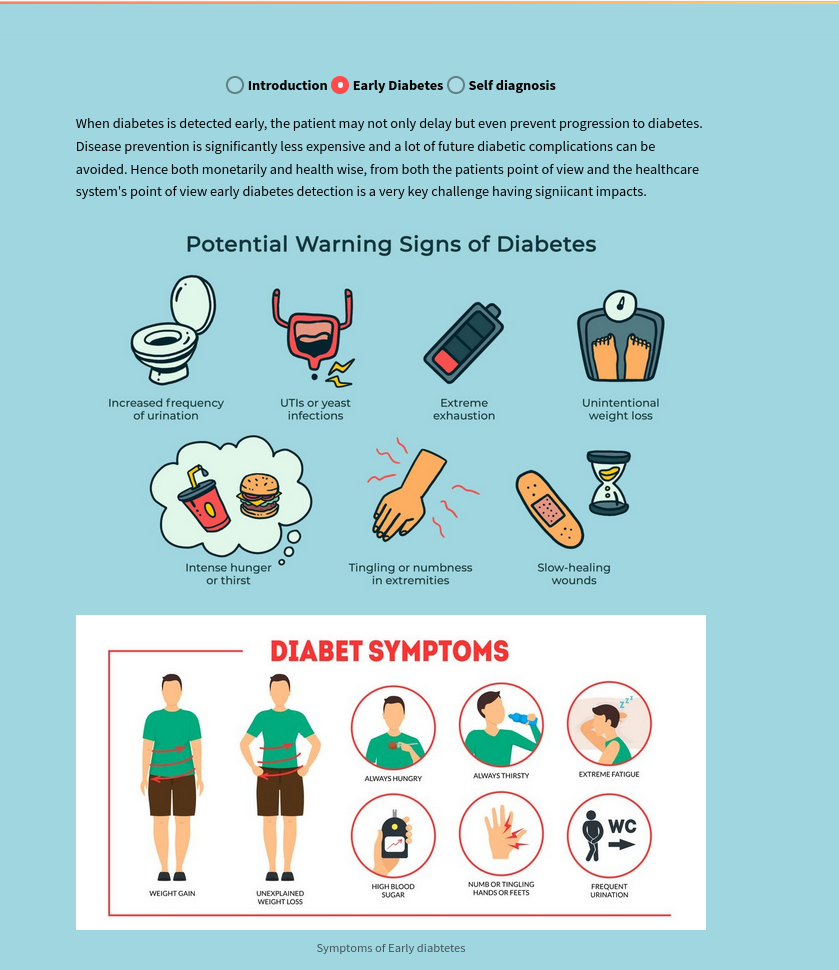
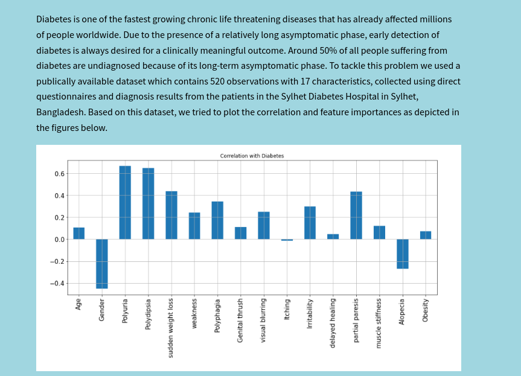
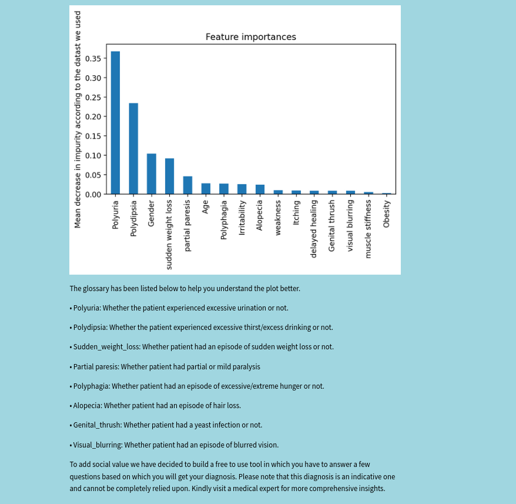
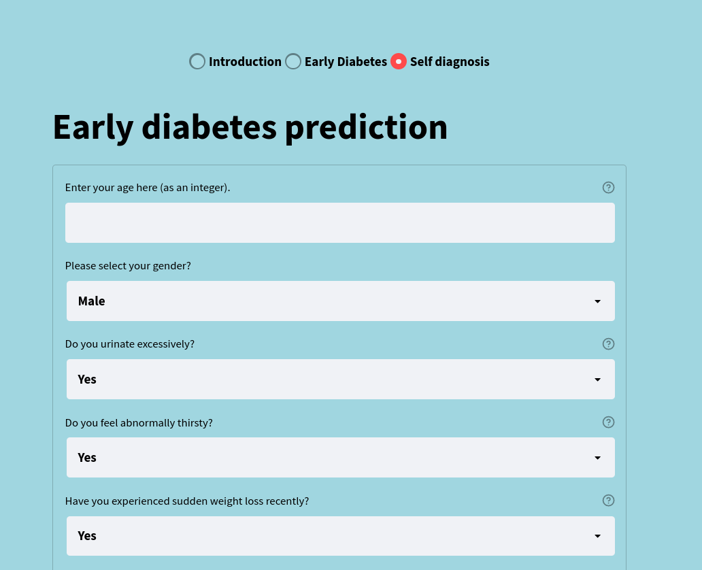
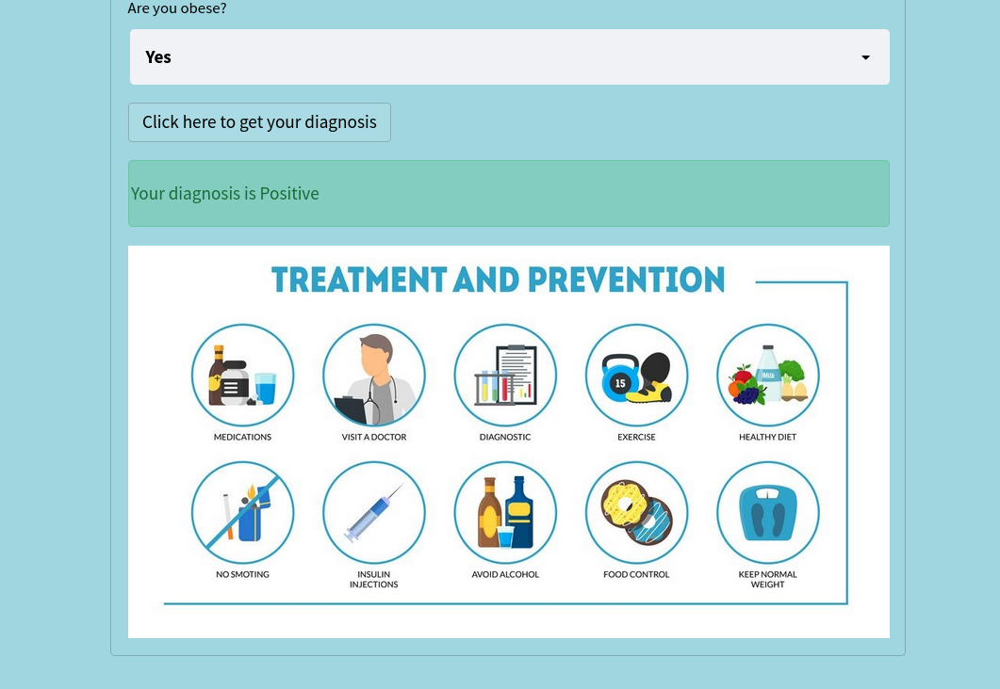
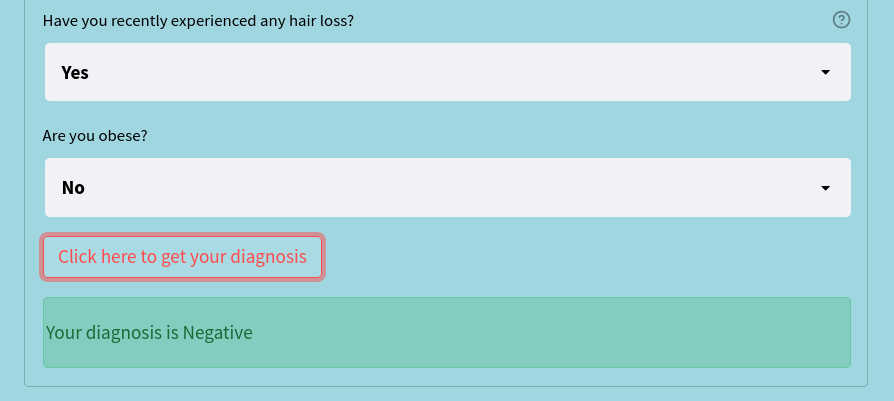

# Early Diabetes Prediction
Course project for DSCI551 at USC in spring 2022.

Team members: __Praveen Iyer__ ;  __Tejas Sujit Bharambe__

## Setup
First you have to install all the required libraries using the command:
```
python -m pip install -r requirements.txt
```
Next you have to setup your streamlit configuration file for this particular project. open the working directory of this project and create a directory named __.streamlit.__ Inside this directory create a file named __config.toml__ and paste the following content inside that file:
```
[theme]
base="light"
backgroundColor="#a0d6e0"
textColor="#000000"
```

Optionally you can also create your own firebase database and replace the existing firebase URL with your URL in the __inputcsvToFirebase.py__.
After doing this you can run __inputcsvToFirebase.py__ to upload the data in the csv file to your firebase database and also change permissions in your firebase to make sure that you can access the datbase from your python code. Make sure if you are doing this to changee the firebase URL in __pass1.py__ as well.

## Some technical details about the project

We decided to use a random forest classifier after trying out different models which includes but is not limited to support vector classifier, categorical naive bayes, logistic regression, deep neural networks and so on. The web application was built using streamlit which had a pythonic way of implemetation. For a more detailed description you can check out the __images_and_reports__ folder which includes comprehensive descriptions and explainations for most of our choices.

## Running the actual web application interface

In the project directory you can run the following command to run the web appliaction:
```
streamlit run pass2_main.py
```

This would open a this web application on your default browser.

Some screenshots of the appliaction has been included here:

---



---

---



---

---



---

---



---

---



---  

---



---

---



---